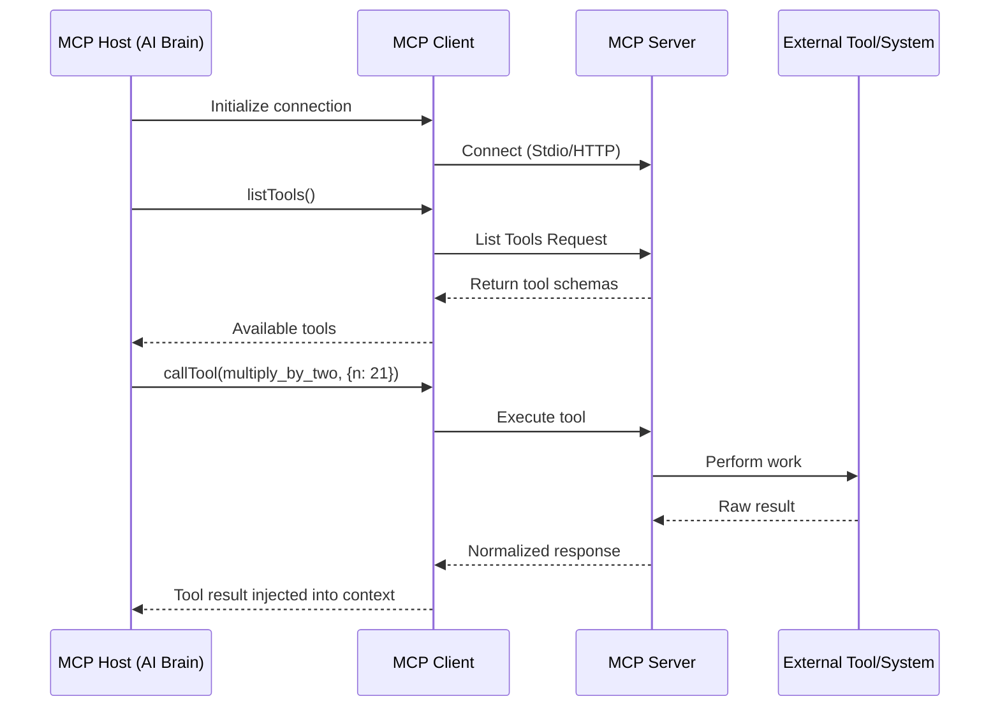
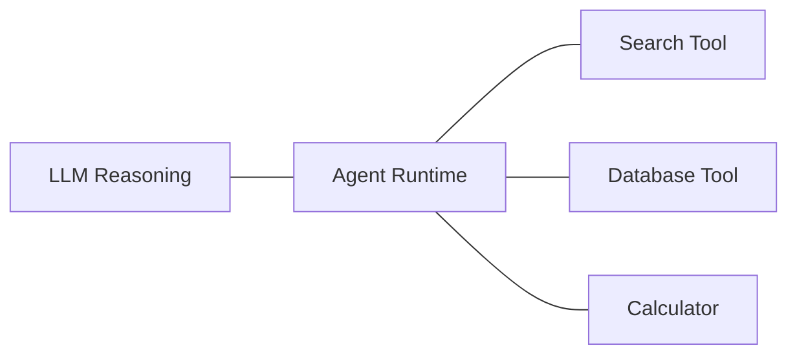
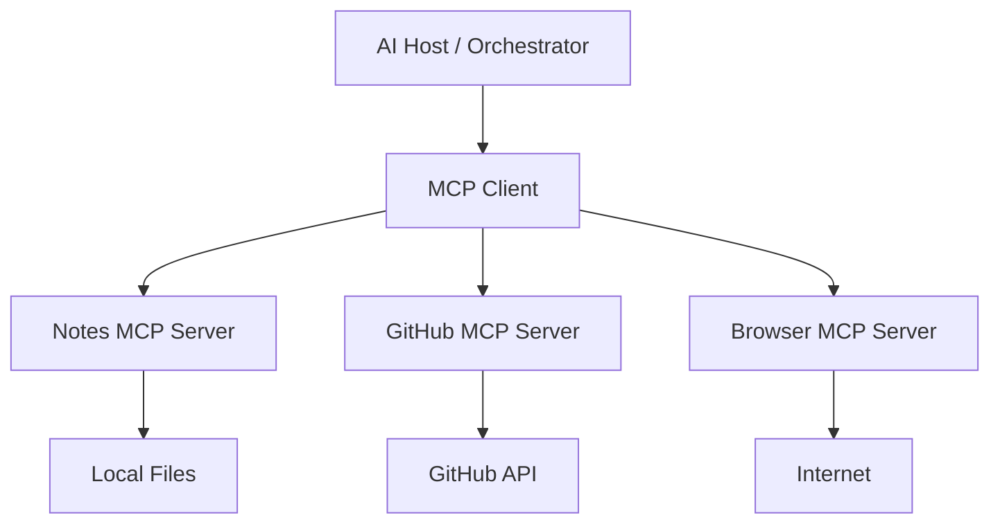

# **The Model Context Protocol (MCP): A Beginner-Friendly Guide to Building Distributed AI Intelligence**

The **Model Context Protocol (MCP)** is an open-standard architecture introduced by Anthropic that standardizes how AI models connect to external tools, data, and capabilities. Think of it as **USB-C for AI** — a universal plug that lets any compatible AI host talk to any compatible capability provider without custom rewiring every time.

Before MCP, connecting an AI to your tools (databases, APIs, files, browsers) required fragile, one-off integrations. Switch your AI host (e.g., from a local script to Claude Desktop or Zed) and you’d rebuild everything. MCP solves this "Tower of Babel" problem by creating a clean, standardized communication layer.

In this comprehensive guide, we’ll go from zero to advanced. We’ll explain every concept multiple times, show plenty of code, draw diagrams, and build toward a **real-world productivity assistant** example.

---

## 1. The Three Core Roles in MCP

MCP defines a clear separation of concerns between three players:

- **MCP Host (The Brain / Client)**: The AI application itself — Claude Desktop, a custom agent runtime, Zed editor, etc. It *reasons* and decides what to do.
- **MCP Server (The Provider / Limbs)**: A lightweight program that exposes specific capabilities (tools, data, prompts). It doesn’t think — it just executes reliably.
- **The Protocol**: JSON-RPC over transports (usually Stdio for local, or HTTP/SSE for remote) that lets Hosts and Servers discover and use each other securely.

**Simple analogy**: The Host is the chef (decides the recipe), the Server is the kitchen assistant (chops vegetables, fetches ingredients), and MCP is the standardized order ticket system.

---

## 2. Why MCP Matters: Beyond Simple Tool Calling

MCP is not just “better function calling.” It’s a **context management revolution**.

### The Three Pillars of MCP Capabilities

1. **Tools** — Executable functions (`calculate_tax`, `search_github`, `resize_image`).
2. **Resources** — Read-only data streams (logs, documentation, live sensor data).
3. **Prompts** — Reusable interaction templates (e.g., a "professional email writer" prompt set).

### Key Architectural Wins

- **Chaining**: Output of one tool automatically feeds into another.
- **History / State**: The host maintains conversation memory across calls.
- **Last-Agent Pattern**: In multi-agent systems, route complex subtasks to specialized final executors.

MCP turns AI systems from **monolithic brains** into **distributed intelligence networks**.

---

## 3. Basic MCP in Action: A Simple Math Server (TypeScript)

Let’s build a minimal but complete example.

### `server.ts` — The Capability Provider

```typescript
// server.ts
import { Server } from "@modelcontextprotocol/sdk/server/index.js";
import { StdioServerTransport } from "@modelcontextprotocol/sdk/server/stdio.js";
import { ListToolsRequestSchema, CallToolRequestSchema } from "@modelcontextprotocol/sdk/types.js";

const server = new Server(
  { name: "math-server", version: "1.0.0" },
  { capabilities: { tools: {} } }
);

// Tell the Host what tools are available
server.setRequestHandler(ListToolsRequestSchema, async () => ({
  tools: [{
    name: "multiply_by_two",
    description: "Takes a number and returns it multiplied by 2",
    inputSchema: {
      type: "object",
      properties: { n: { type: "number" } },
      required: ["n"]
    }
  }]
}));

// Actually execute the tool when called
server.setRequestHandler(CallToolRequestSchema, async (req) => {
  if (req.params.name === "multiply_by_two") {
    const n = (req.params.arguments as any).n;
    const result = n * 2;
    
    return { 
      content: [{ 
        type: "text", 
        text: `The result of multiplying ${n} by 2 is ${result}` 
      }] 
    };
  }
  throw new Error("Unknown tool");
});

await server.connect(new StdioServerTransport());
console.log("Math MCP Server running...");
```

### `client.ts` — Connecting to the Server

```typescript
// client.ts
import { Client } from "@modelcontextprotocol/sdk/client/index.js";
import { StdioClientTransport } from "@modelcontextprotocol/sdk/client/stdio.js";

export async function createMCPClient() {
  const transport = new StdioClientTransport({
    command: "node",
    args: ["server.js"]
  });

  const client = new Client(
    { name: "math-client", version: "1.0.0" },
    { capabilities: {} }
  );

  await client.connect(transport);
  return client;
}
```

### `agent.ts` — The Reasoning Layer

```typescript
// agent.ts
export async function runMathAgent(client: any, input: number) {
  console.log("🔍 Agent discovering available tools...");
  const tools = await client.listTools();
  console.log("Available tools:", tools.tools.map((t: any) => t.name));

  console.log(`🧠 Agent deciding to call multiply_by_two with ${input}`);
  const result = await client.callTool({
    name: "multiply_by_two",
    arguments: { n: input }
  });

  return result;
}
```

### `runner.ts` — Putting It All Together

```typescript
// runner.ts
import { createMCPClient } from "./client.js";
import { runMathAgent } from "./agent.js";

async function main() {
  const client = await createMCPClient();
  const result = await runMathAgent(client, 21);
  console.log("✅ Final Result:", result);
}

main().catch(console.error);
```

**Run it**: `node runner.ts`

This modular setup is powerful — you can add new servers (file system, web browser, database) without changing your agent logic.

---

## 4. Lifecycle of an MCP Request (Explained Visually)



**Key point**: The Host (AI) stays in control. The Server only executes what it’s asked to do.

---

## 5. Real-World Example: Building a Personal Productivity Assistant

Imagine an AI assistant that can:
- Search your local notes
- Query GitHub issues
- Perform calculations
- Summarize web pages
- Manage calendar events

With MCP, each capability lives in its own server:

- `notes-mcp-server`
- `github-mcp-server`
- `calendar-mcp-server`
- `web-browser-mcp-server`

The main agent discovers all tools dynamically and chains them:

**User request**: “Find my latest GitHub PRs, summarize the comments, and create a todo list in my notes.”

**Behind the scenes**:
1. Agent calls GitHub MCP → lists PRs
2. Chains to Browser MCP → scrapes comment threads
3. Chains to Notes MCP → creates structured todo

**Chaining example code snippet**:

```typescript
async function handleComplexTask(client: any, userQuery: string) {
  // Agent reasons and decides sequence
  const prs = await client.callTool({ name: "list_recent_prs" });
  const summary = await client.callTool({ 
    name: "summarize_text", 
    arguments: { text: prs.content } 
  });
  return await client.callTool({
    name: "create_note",
    arguments: { title: "PR Follow-ups", content: summary.text }
  });
}
```

---

## 6. Architectural Transformation: Before vs After MCP

### Before MCP (Monolithic)



**Problems**: Everything in one process. Hard to scale, update, or secure.

### After MCP (Distributed Intelligence)



**This is the big shift**: Your agent becomes a **smart conductor** instead of owning the entire orchestra.

---

## 7. Advanced Patterns: Control Plane, Fallbacks, and Resilience

### Model + MCP Fallback Chains

```typescript
const modelChain = ["claude-3.5-sonnet", "gpt-4o", "gemini-1.5"];
const mcpChain = ["primary-search", "backup-scraper"];

async function resilientExecute(ctx: any) {
  for (const model of modelChain) {
    try {
      return await callWithMCPFallback(ctx, model);
    } catch (e) {
      console.warn(`Model ${model} failed, trying next...`);
    }
  }
}
```

### The Full Intelligence Control Plane

Modern MCP systems include:
- **Routing Engine** — Decides which model + tool chain to use
- **Cache Layer** — Semantic + exact match caching
- **Observability** — Full tracing of decisions
- **Cost Policies** — Route expensive vs cheap models dynamically

---

## 8. Best Practices & Security

- Run MCP servers in sandboxed environments (especially those accessing filesystem or network).
- Use Stdio transport for local development (fast, streaming-native).
- Keep business logic in Servers — Hosts should only orchestrate.
- Design small, focused tools. Let the LLM handle chaining logic.
- Always validate and sanitize inputs in production servers.

---

## Final Summary: From Agents to Intelligence Infrastructure

MCP represents a fundamental evolution:

> **You are no longer just writing agents.**  
> **You are designing distributed intelligence infrastructure.**

- **MCP** = Execution network
- **Models** = Reasoning layer
- **Cache** = Memory layer
- **Routing** = Control plane
- **Observability** = Nervous system
- **Fallbacks** = Immune system

Start small with one server and one tool. Gradually expand into a full capability network. The modular, discoverable nature of MCP makes this growth natural and exciting.

**Ready to build?** Clone the official MCP SDK examples, start with a simple calculator or file reader server, and watch your AI suddenly gain real superpowers.

---

*This guide combines foundational explanations with production-grade patterns. The future of AI isn’t bigger models — it’s better connections.*