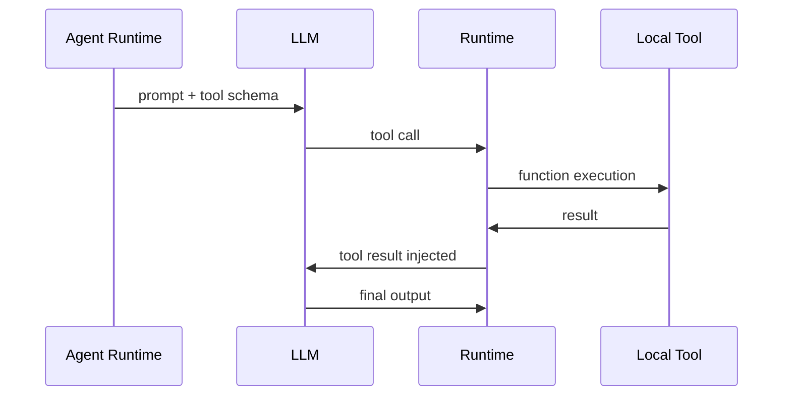
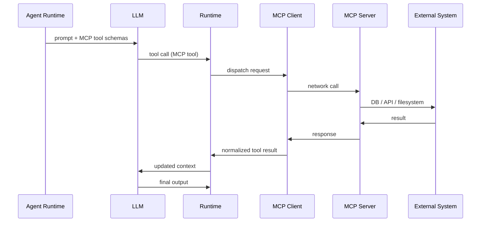

# 🌐 How MCP Servers Change the Agent Architecture

MCP (Model Context Protocol) is not just a “tool plugin system.”

It fundamentally changes the **boundary of what an agent runtime is responsible for**.

If traditional agent systems are **closed-loop execution engines**, MCP turns them into **distributed reasoning orchestrators over external capability networks**.

Let’s make that concrete.

---

# 🧠 1. Before MCP: The Agent Owns Everything

In a classic OpenAI Agents SDK setup:

```ts
const agent = new Agent({
  tools: [
    searchTool,
    dbQueryTool,
    calculatorTool
  ]
});
```

## ⚙️ Architectural reality

Everything lives inside your process:

* tools are local functions
* execution is in-process
* the runtime fully controls orchestration
* failure domain is the application itself

---

## 🔁 Execution model



---

## 🧠 Key property

> The agent is a **self-contained brain + body system**

It both:

* reasons (LLM)
* acts (tools)

Everything is owned by the same runtime boundary.

---

# 🌐 2. With MCP: Tools Move Outside the Runtime

Now replace local tools with MCP servers:

```ts
agent → MCP Client → MCP Server → External Systems
```

Tools are no longer functions.

They become **network-addressable capabilities**.

---

## 🧩 New reality

Instead of:

```ts
calculate()
queryDatabase()
searchWeb()
```

You now interact with:

```txt
mcp://calculator/evaluate
mcp://postgres/runQuery
mcp://browser/extract
```

Or conceptually:

> tools become endpoints, not functions

---

## 🧠 Key shift

> Tools are no longer part of the program — they are external services with their own lifecycle.

---

# ⚙️ 3. MCP Architecture Overview



---

# 🧠 4. The Deep Architectural Shift

## Before MCP

```
Agent Runtime = Brain + Tools + Execution
```

A single tightly coupled system.

---

## After MCP

```
Agent Runtime = Brain + Orchestrator
Tools = External capability services
```

---

## 🔥 Core insight

> MCP separates **reasoning** from **execution capability**

The agent no longer *does the work itself* — it delegates.

---

# 🧩 5. MCP Introduces a “Capability Network”

Instead of hardcoded tools, agents connect to:

```
MCP Servers = distributed capability providers
```

Each server can expose multiple primitive types:

* tools (actions)
* resources (data access)
* prompts (prebuilt instruction templates)

---

## Example MCP servers

### GitHub MCP

```ts
tools:
  - createIssue
  - listPRs
  - mergePR
```

### Database MCP

```ts
tools:
  - runQuery
  - describeSchema
```

### Browser MCP

```ts
tools:
  - openPage
  - click
  - extractText
```

---

## 🧠 Key shift

> The agent is now operating over a **distributed capability graph**, not a local function set.

---

# ⚙️ 6. How MCP Changes the Agent Loop Internally

## Before MCP

```ts
act() → local tool execution
```

Fast, synchronous, in-process.

---

## After MCP

```ts
act() → remote tool dispatch
```

Now includes network latency, serialization, and external failure modes.

---

## 🔁 Updated execution loop

```ts
while (!done) {
  observe();   // includes MCP tool schemas
  think();     // model selects MCP tool
  dispatch();  // send request to MCP server
  wait();      // network round trip
  integrate(); // normalize tool response
}
```

---

# 🌍 7. MCP Turns Tools Into a “Plugin Internet”

Without MCP:

* tools are compiled into the application
* deployment requires redeploying code
* scaling tools = scaling the app

---

With MCP:

> tools become independently deployed services

---

## 🟢 Consequences

### 1. Decoupling

Tools evolve without modifying the agent runtime.

---

### 2. Composability

A single agent can use many MCP servers:

```
GitHub MCP + DB MCP + Slack MCP + Browser MCP
```

---

### 3. Dynamic discovery

Agents can discover new tools at runtime instead of compile time.

---

# 🔥 8. The Biggest Change: Tools Become Addressable

Instead of:

```ts
searchTool()
```

You now operate over network addresses:

```txt
mcp://search-server/search
mcp://github/createIssue
mcp://db/runQuery
```

---

## 🧠 Key insight

> Tools become **addressable capabilities in a network**, not static code.

---

# 🧠 9. MCP vs Traditional Tools (Core Difference)

| Dimension      | Traditional Tools | MCP Tools                 |
| -------------- | ----------------- | ------------------------- |
| Location       | In-process        | External servers          |
| Scaling        | App scales tools  | Tools scale independently |
| Deployment     | Coupled           | Decoupled                 |
| Discovery      | Static            | Dynamic                   |
| Ownership      | Codebase          | Service providers         |
| Failure domain | App crash         | Network failure           |

---

# 💣 10. New Failure Modes Introduced by MCP

MCP increases capability but introduces distributed systems complexity.

---

## ❌ Network latency

Every tool call becomes:

> 10ms → 500ms+ round trip

---

## ❌ Partial failure

MCP servers can:

* timeout
* rate limit
* degrade gracefully

---

## ❌ Consistency issues

Tool outputs may vary due to:

* external state changes
* API evolution
* database drift

---

## ❌ Versioning problems

Different MCP servers evolve independently of the agent runtime.

---

# 🧠 11. How MCP Changes `run()` Internally

Your original:

```ts
await run(agent, input);
```

Becomes:

```ts
LLM loop
  ↳ MCP tool discovery
  ↳ MCP tool selection
  ↳ MCP dispatch
  ↳ MCP response normalization
  ↳ context update
repeat
```

---

## 🧠 Key insight

> `run()` is no longer just orchestration over tools — it becomes orchestration over a **distributed capability graph**

---

# 🚀 12. The Deep Architectural Shift

## Without MCP

> “Agents are programs that call functions”

---

## With MCP

> “Agents are reasoning engines that orchestrate external capability networks”

---

# 🧩 Final Mental Model

If we compress everything:

### 🧠 Agent Runtime

Decides *what to do*

### 🌐 MCP Servers

Provide *how it gets done*

### 🔁 MCP Protocol

Connects reasoning to execution across a network boundary

---

# 🚀 Final Insight

MCP doesn’t just extend agents.

It changes their identity:

> From **tool-using programs**
> to **distributed reasoning orchestrators over a capability cloud**
