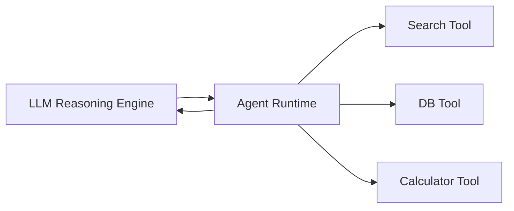
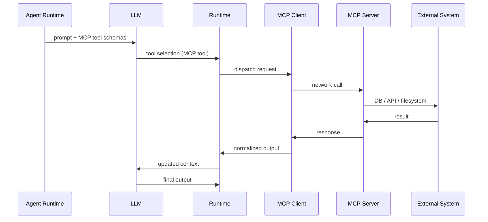
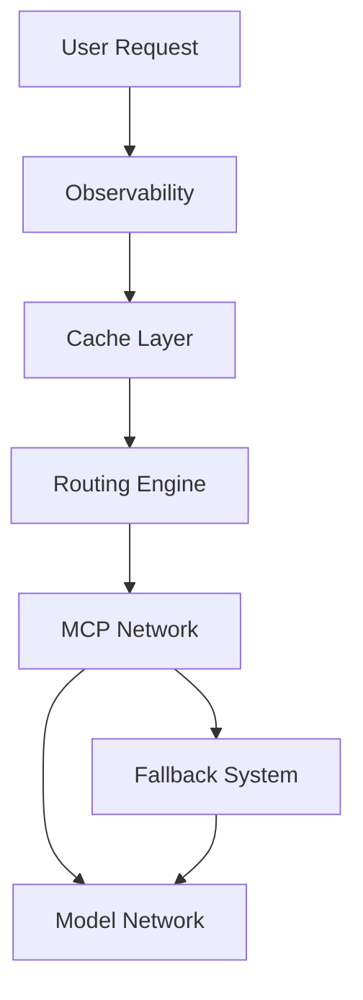
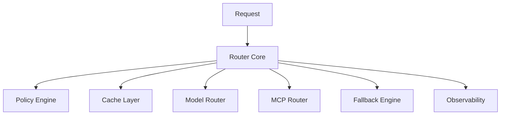

# 🌐 How MCP Servers Change the Agent Architecture

## From Local Tools to Distributed Intelligence Control Planes

MCP (Model Context Protocol) is not just a “tool plugin system.”

It fundamentally changes the **boundary of what an agent runtime is responsible for**.

If traditional agent systems are **closed-loop execution engines**, MCP turns them into **distributed reasoning orchestrators over external capability networks**.

But to really understand why this matters, we need to start with how agent systems *used to work*.

---

# 🧠 1. Before MCP: The Agent Owns Everything

In a classic OpenAI Agents SDK-style architecture, tools are local functions registered inside the runtime.

```ts
const agent = new Agent({
  tools: [
    searchTool,
    dbQueryTool,
    calculatorTool
  ]
});
```

Everything is embedded inside the same process boundary.

---

## ⚙️ Architectural reality

All execution lives inside your application:

* tools are in-process functions
* no network boundary for execution
* deterministic deployment unit
* failure domain = your app

---

## 🧱 System architecture



---

## 🔁 Execution model


---

## 🧠 Key property

> The agent is a **self-contained brain + body system**

It both:

* reasons (LLM)
* acts (tools)

Everything is owned inside one execution boundary.

---

# 🌐 2. With MCP: Tools Move Outside the Runtime

Now replace local tools with MCP servers.

```ts
agent → MCP Client → MCP Server → External Systems
```

Tools are no longer functions.

They become **network-addressable capabilities**.

---

## 🧩 New reality

Instead of:

```ts
calculate()
queryDatabase()
searchWeb()
```

You now operate over:

```txt
mcp://calculator/evaluate
mcp://postgres/runQuery
mcp://browser/extract
```

---

## 🧠 Key shift

> Tools are no longer part of the program — they are external services with independent lifecycles.

---

# ⚙️ 3. MCP Architecture Overview



---

# 🧠 Architectural shift

### Before MCP

```
Agent Runtime = Brain + Tools + Execution
```

### After MCP

```
Agent Runtime = Brain + Orchestrator
Tools = External capability services
```

---

# 🔥 4. The Capability Network Model

MCP introduces a distributed system of capabilities:

```
MCP Servers = distributed capability providers
```

---

## Example MCP servers

### GitHub MCP

```ts
tools:
  - createIssue
  - listPRs
  - mergePR
```

### Database MCP

```ts
tools:
  - runQuery
  - describeSchema
```

### Browser MCP

```ts
tools:
  - openPage
  - click
  - extractText
```

---

## 🧠 Key insight

> The agent operates over a **distributed capability graph**, not a local function table.

---

# ⚙️ 5. MCP Changes the Agent Loop

## Before MCP

```ts
act() → local function call
```

Fast, deterministic, in-process.

---

## After MCP

```ts
act() → network dispatch → remote execution
```

Now we introduce:

* latency
* serialization
* retries
* partial failures

---

## 🔁 Updated execution loop

```ts
while (!done) {
  observe();   // MCP tool schemas included
  think();     // LLM selects tool
  dispatch();  // MCP network call
  wait();      // network latency
  integrate(); // normalize response
}
```

---

# 🌍 6. MCP Turns Tools Into a Plugin Internet

## Without MCP

* tools compiled into application
* redeploy required for changes
* scaling tools = scaling app

---

## With MCP

> tools become independently deployed services

---

### 🟢 Consequences

* decoupling
* composability
* dynamic discovery

---

# 🔁 7. Agent Chaining: Before vs After MCP

## ❌ Before MCP: Hardcoded chaining

```ts
const result1 = await searchAgent.run(input);
const result2 = await dbAgent.run(result1);
const result3 = await summaryAgent.run(result2);
```

Problems:

* rigid pipeline
* no dynamic routing
* tightly coupled agents

---

## ✅ After MCP: Dynamic execution graph

```ts
agent → MCP(toolA) → MCP(toolB) → MCP(toolC)
```

Or fully LLM-driven:

```ts
observe → plan → toolA → toolB → toolC → finalize
```

---

## 🧠 Insight

> MCP turns chaining from code orchestration into runtime-planned execution graphs.

---

# 🔥 8. Fallback Chains (Model + MCP)

Production systems are defined less by capability and more by **recovery behavior**.

---

## 🧠 8.1 Model Fallback Chain

```ts
const modelChain = [
  "openai/gpt-4o",
  "anthropic/claude-3.5-sonnet",
  "google/gemini-1.5-pro"
];
```

```ts
async function runModel(prompt: string) {
  for (const model of modelChain) {
    try {
      return await callModel(model, prompt);
    } catch {
      continue;
    }
  }
  throw new Error("All models failed");
}
```

---

## 🌐 8.2 MCP Fallback Chain

```ts
const mcpChain = [
  "mcp://search-primary/query",
  "mcp://search-backup/query",
  "mcp://browser-scraper/extract"
];
```

---

## 🧠 Insight

> Production agents require dual-layer resilience:
>
> * reasoning fallback (models)
> * execution fallback (MCP tools)

---

# 💰 9. Cost Optimization Strategies

Once systems become distributed, cost becomes a **routing variable**, not a billing artifact.

---

## 🧠 9.1 Cost-aware routing

```ts
function selectModel(models, mode) {
  if (mode === "cheap") return minBy(models, m => m.cost);
  if (mode === "fast") return minBy(models, m => m.latency);
  return maxBy(models, m => m.quality);
}
```

---

## 🧠 Insight

> Cost becomes a **first-class routing signal**

---

# 🧭 10. Routing Policies (Control Plane)

At this stage, hardcoded logic collapses under complexity.

We introduce:

> routing policies = decision layer over execution space

---

## Policy signature

```ts
(input, context) → { model, mcpChain, fallbackStrategy }
```

---

## Insight

> Execution is no longer coded — it is selected.

---

# 📡 11. Observability for MCP Systems

Once MCP + routing + fallback exist, debugging becomes impossible without full traces.

---

## 🧠 What must be observable

* model selection + fallback path
* MCP tool execution chain
* routing decisions
* latency breakdown
* cost accumulation
* cache behavior

---

## 🔁 Execution trace model

```ts
type Span =
  | "model_call"
  | "mcp_call"
  | "routing_decision"
  | "cache_hit"
  | "fallback";
```

---

## 🧠 Insight

> Observability turns distributed execution into replayable history.

---

# ⚡ 12. Caching Layer in MCP Systems

At scale, most requests are not new problems.

They are **repetitions of previously solved states**.

---

## 🧠 12.1 Three cache layers

### Response cache

```
input → output
```

### MCP tool cache

```
query → tool result
```

### Semantic cache

```
meaning → prior response
```

---

## 🧠 Insight

> The best computation is the computation you never execute.

---

## 💰 12.2 Cache-aware routing

```ts
if (cacheHitProbability > 0.7) {
  skipModel();
  skipMCP();
}
```

---

# 🔁 12.3 Final system architecture



---

# 🚀 Final Insight

Once MCP, routing, fallback, cost control, observability, and caching are combined:

> You no longer have an “agent system.”

You have:

> 🧠 a **self-optimizing distributed intelligence runtime**

Where:

* MCP = execution network
* Models = reasoning layer
* Cache = memory layer
* Observability = nervous system
* Routing = control plane
* Fallback = immune system
* Cost = economic constraint layer

---

# 🧭 13. Agentic Control Plane (TypeScript Design)

To make this concrete, we can turn the architecture into a **router framework**.

---

## 🏗️ Core idea

Instead of calling tools directly:

```ts
await callMCP(...)
await callModel(...)
```

You do:

```ts
await router.execute({
  input,
  context,
  policy: "balanced"
});
```

---

## 📦 System architecture



---

## 🧠 Core types

```ts
export type RoutingContext = {
  input: string;
  budget?: number;
  latencyBudget?: number;
  riskLevel?: "low" | "medium" | "high";
};
```

---

## 🧭 Router core

```ts
export class MCPRouter {
  async execute(ctx: RoutingContext) {
    const cached = await cache.get(ctx.input);
    if (cached) return cached;

    const policy = policyEngine.select(ctx);

    const toolResult = await mcpRouter.execute(policy.mcpChain, ctx);
    const output = await modelRouter.execute(policy.modelChain, toolResult);

    await cache.set(ctx.input, output);
    return output;
  }
}
```

---

## 🧠 Model router (fallback-aware)

```ts
for (const model of chain) {
  try {
    return await callModel(model, input);
  } catch {
    continue;
  }
}
```

---

## 🌐 MCP router

```ts
for (const endpoint of chain) {
  try {
    return await callMCP(endpoint, input);
  } catch {
    continue;
  }
}
```

---

## 🧭 Policy engine

```ts
if (ctx.budget < 0.01) return costPolicy;
if (ctx.riskLevel === "high") return qualityPolicy;
return balancedPolicy;
```

---

## 📡 Observability

Every decision becomes a trace:

```ts
trace.addSpan("model.selected");
trace.addSpan("mcp.call");
trace.addSpan("cache.hit");
```

---

# 🚀 Final Mental Model

You are no longer building agents.

You are building:

> 🧠 a **distributed intelligence control plane**

---

## Layers

* MCP → execution network
* Models → reasoning system
* Cache → memory system
* Routing → decision system
* Observability → nervous system
* Fallback → resilience system
* Policies → governance system

---

## Final Insight

This is the shift:

> from writing agents
> to designing intelligence infrastructure
