# Architecture Guide

Understanding the internal architecture of the OpenRouter MCP Course.

This document explains:

* how agents are created
* how execution flows through the system
* how OpenRouter integrates with the SDK
* how fallback models work
* how conversation memory is preserved
* how tools execute
* how multi-agent chains function
* how the repository evolves toward MCP architecture

This guide is intentionally beginner-friendly and verbose.

---

# Table of Contents

1. High-Level System Architecture
2. Repository Layers
3. OpenAI Agents SDK Architecture
4. OpenRouter Integration
5. Shared Agent Factory Pattern
6. Resilient Runner Architecture
7. Fallback Model Rotation
8. Result Object Lifecycle
9. Multi-Turn Conversation Architecture
10. Tool Execution Architecture
11. Multi-Agent Chaining
12. Streaming Architecture
13. Error Handling Strategy
14. Why This Architecture Matters
15. Evolution Toward MCP

---

# 1. High-Level System Architecture

At the highest level, the repository looks like this:

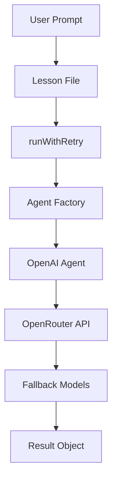

---

# Beginner Explanation

The repository is divided into multiple layers.

Instead of calling models directly everywhere, we centralize responsibilities.

This allows:

* cleaner code
* easier debugging
* provider failover
* reusable architecture
* production scalability

---

# 2. Repository Layers

The repository intentionally separates concerns.

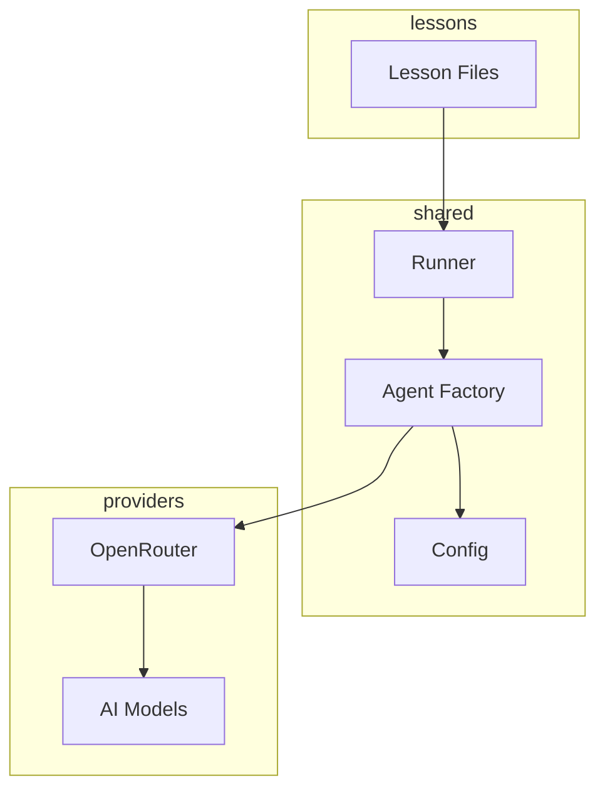

---

# Why Layering Matters

Without layering, every file would duplicate:

* API configuration
* retry logic
* model settings
* headers
* timeouts
* orchestration

Layering avoids repetition.

This becomes critical in large AI systems.

---

# 3. OpenAI Agents SDK Architecture

The OpenAI Agents SDK revolves around a few key concepts:

* Agent
* Runner
* run()
* Result objects
* Tools
* History

---

# Agent Lifecycle

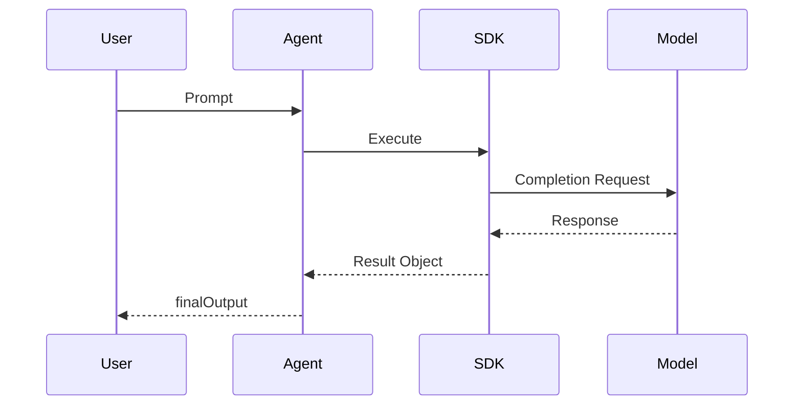

---

# Key Idea

An Agent is not the model itself.

An Agent is:

* instructions
* tools
* model configuration
* execution metadata

The SDK orchestrates communication between:

* your code
* the model provider
* the execution runtime

---

# 4. OpenRouter Integration

The repository uses OpenRouter as an OpenAI-compatible backend.

---

# Why OpenRouter?

OpenRouter provides:

* access to many providers
* model abstraction
* free-tier models
* fallback flexibility

Instead of locking into one provider, we gain portability.

---

# OpenRouter Request Flow

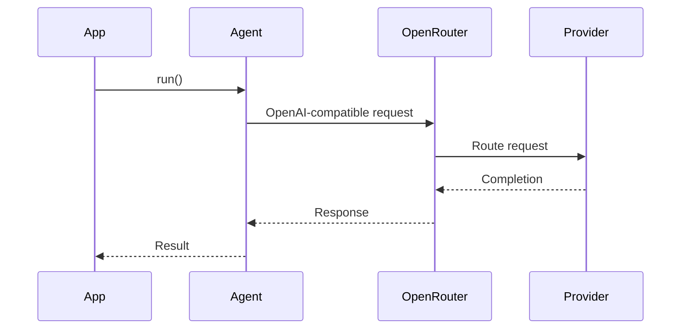

---

# Beginner Insight

Even though we use the OpenAI Agents SDK:

```ts id="tgnclv"
import { Agent } from "@openai/agents";
```

the requests are actually routed to OpenRouter.

This works because OpenRouter implements OpenAI-compatible APIs.

---

# 5. Shared Agent Factory Pattern

One of the most important architectural patterns in the repository is the Shared Agent Factory.

---

# The Problem

Without factories:

```ts id="s6x4sp"
const agent = new Agent({
  ...
});
```

would appear in every file.

That causes:

* duplicated configuration
* inconsistent settings
* difficult maintenance

---

# The Solution

Centralize creation logic.

---

# Factory Architecture

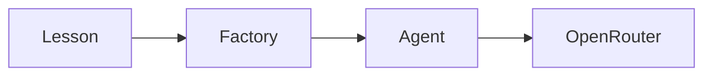

---

# Shared Factory Example

```ts id="6q0q2x"
export function createRecipeAgent(model: string) {
  return new Agent({
    name: "Recipe Chef",

    instructions: [
      {
        role: "system",
        content: "You are a creative chef."
      }
    ],

    model,

    clientOptions: {
      baseURL: OPENROUTER_BASE_URL,
      apiKey: OPENAI_API_KEY
    }
  });
}
```

---

# Benefits

Factories provide:

* consistency
* scalability
* centralized upgrades
* reusable orchestration

This is a common enterprise architecture pattern.

---

# 6. Resilient Runner Architecture

The resilient runner is the heart of fault tolerance.

---

# Why We Need It

Free-tier models frequently fail.

Common issues:

| Error | Meaning          |
| ----- | ---------------- |
| 429   | Rate limited     |
| 500   | Provider failure |
| 404   | Model removed    |
| 402   | Credit exhausted |

Without retries, applications become unstable.

---

# Resilient Flow

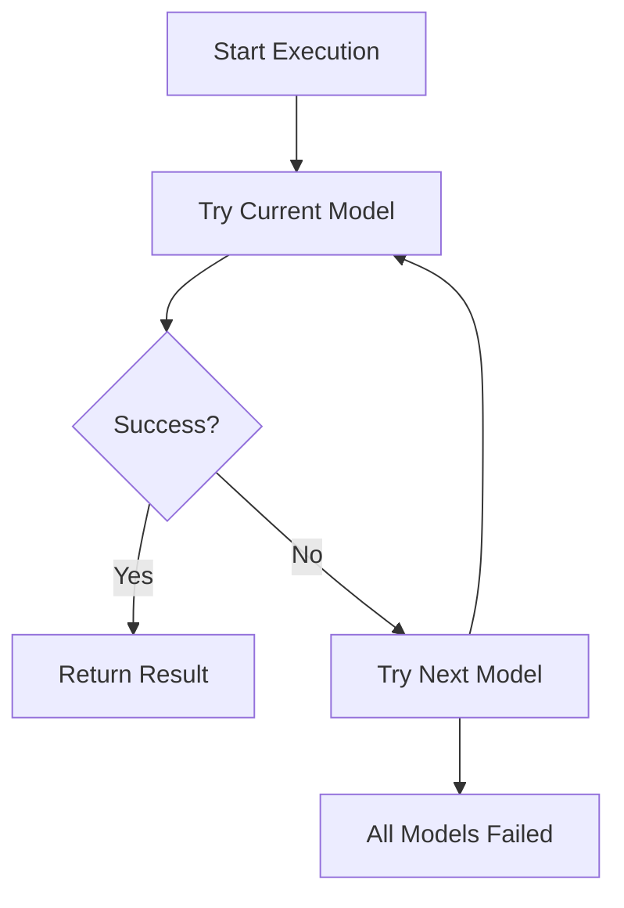

---

# Beginner Explanation

The system tries models one-by-one until one succeeds.

This is called:

* failover
* fallback rotation
* resilient orchestration

Production AI systems use this heavily.

---

# Recursive Retry Pattern

```ts id="v4u86k"
await main(modelIndex + 1);
```

This creates a retry chain.

---

# Loop-Based Retry Pattern

```ts id="cgrqkr"
for (const model of MODEL_FALLBACK_CHAIN) {
  ...
}
```

This creates iterative failover.

Both approaches are demonstrated intentionally.

---

# 7. Fallback Model Rotation

The repository maintains a centralized fallback list.

```ts id="tw5y8r"
export const MODEL_FALLBACK_CHAIN = [
  'openai/gpt-oss-120b:free',
  'deepseek/deepseek-v4-flash:free',
  ...
];
```

---

# Why Centralization Matters

If models change:

* update one file
* entire repository updates automatically

This is called:

* configuration centralization
* dependency abstraction

---

# Model Rotation Flow

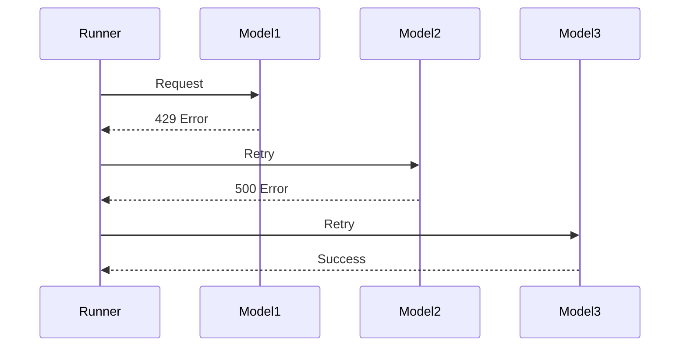

---

# 8. Result Object Lifecycle

Most beginners only use:

```ts id="i1ic0k"
result.finalOutput
```

But the SDK returns much more.

---

# Result Object Structure

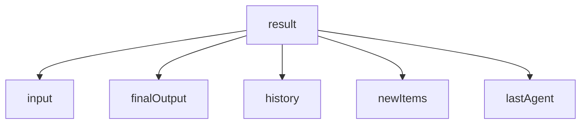

---

# Why Result Objects Matter

Result objects enable:

* debugging
* memory persistence
* multi-agent workflows
* orchestration tracing
* auditability

---

# Example

```ts id="j0k0aq"
console.log(result.history);
console.log(result.newItems);
console.log(result.lastAgent);
```

---

# 9. Multi-Turn Conversation Architecture

Conversation memory is implemented through history persistence.

---

# Conversation Lifecycle

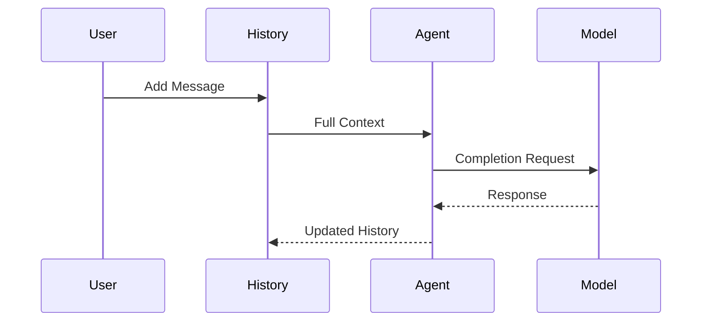

---

# Key Concept

Models are stateless.

They do NOT remember previous conversations automatically.

Memory is simulated by resending conversation history.

---

# History Structure

```ts id="r8gx5l"
history.push(user("Hello"));
```

Each interaction expands the context window.

---

# Interactive Chat Loop

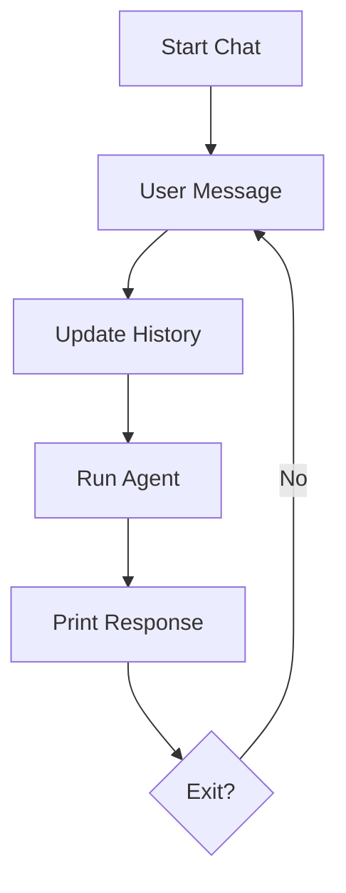

---

# 10. Tool Execution Architecture

Tools allow agents to execute structured actions.

---

# Tool Flow

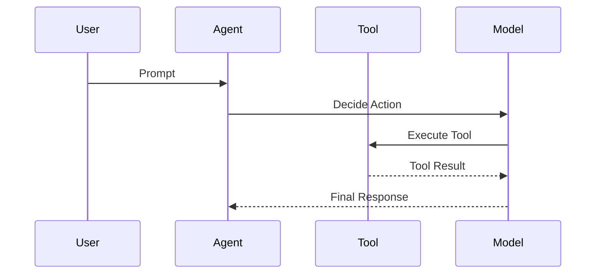

---

# Beginner Explanation

The model decides:

* whether a tool is needed
* which tool to use
* what parameters to pass

The SDK orchestrates execution automatically.

---

# Tool Definition

```ts id="b7zw5g"
const myTool = tool({
  name: "echo_tool",

  parameters: z.object({
    message: z.string()
  }),

  async execute({ message }) {
    return `Echo: ${message}`;
  }
});
```

---

# Why Zod Matters

Zod provides:

* runtime validation
* schema enforcement
* safer execution
* predictable tooling

This becomes essential for MCP.

---

# 11. Multi-Agent Chaining

One agent can feed another.

---

# Example Chain

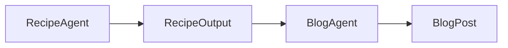

---

# Real Example

Step 1:

* generate recipe

Step 2:

* pass history into blog writer

---

# Sequence Diagram

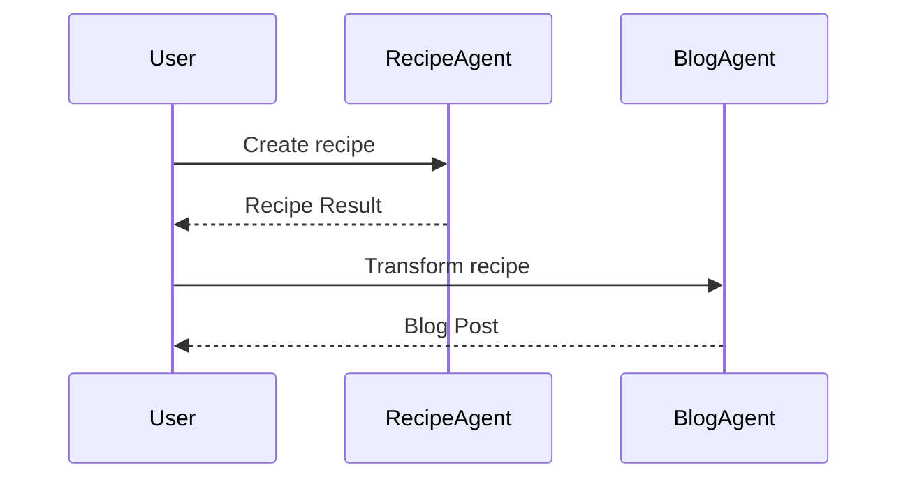

---

# Why This Matters

This introduces:

* orchestration graphs
* distributed workflows
* specialized agents
* cooperative execution

These are foundational MCP concepts.

---

# 12. Streaming Architecture

Streaming allows incremental token delivery.

---

# Streaming Flow

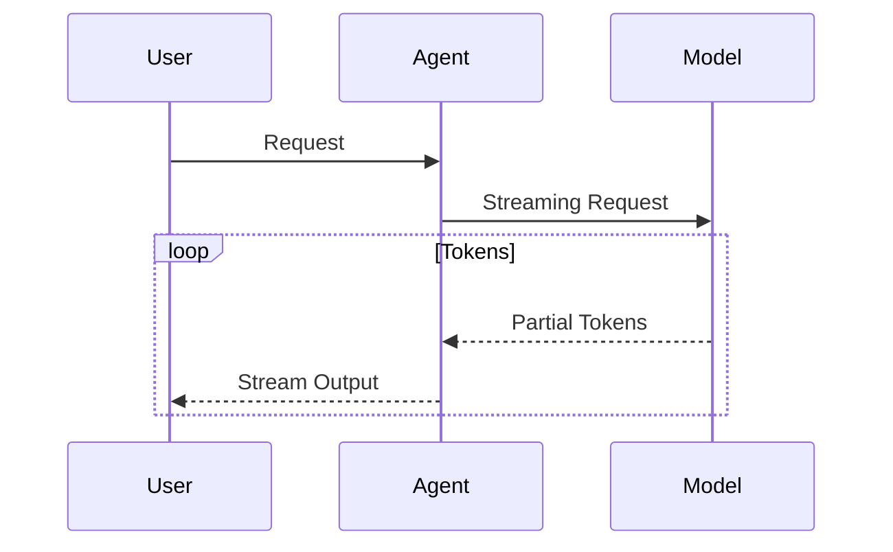

---

# Why Streaming Matters

Streaming improves:

* responsiveness
* user experience
* perceived performance
* interactive systems

Streaming is essential for:

* chat applications
* copilots
* IDE assistants
* MCP transports

---

# 13. Error Handling Strategy

The repository intentionally handles failures explicitly.

---

# Error Categories

| Status | Meaning           |
| ------ | ----------------- |
| 429    | Rate limit        |
| 500    | Provider failure  |
| 404    | Model unavailable |
| 402    | Credits exhausted |

---

# Error Recovery Flow

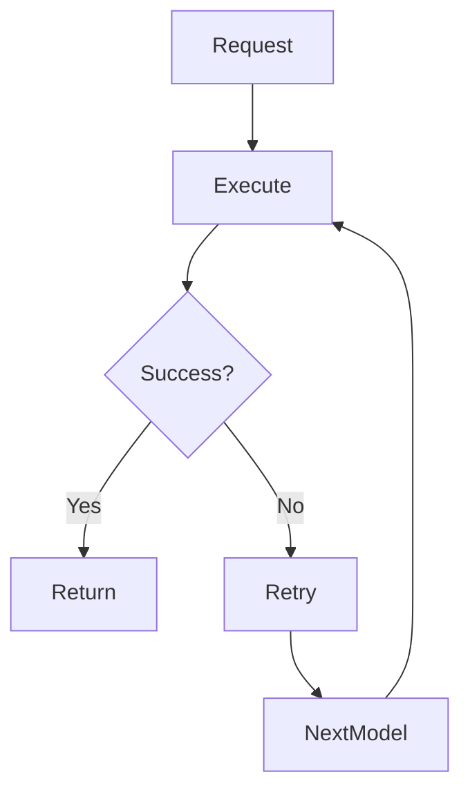

---

# Why Explicit Error Handling Matters

Production AI systems must survive unreliable providers.

Without resilience:

* conversations break
* chains fail
* workflows crash

---

# 14. Why This Architecture Matters

This repository intentionally mirrors real-world AI systems.

---

# Traditional Tutorial Architecture

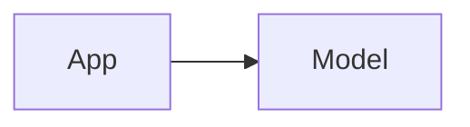

Simple but fragile.

---

# Production Architecture

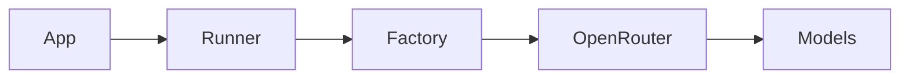

More complex but:

* scalable
* resilient
* maintainable
* extensible

---

# 15. Evolution Toward MCP

This repository gradually prepares you for MCP.

---

# What Is MCP?

Model Context Protocol (MCP) standardizes how:

* tools
* agents
* memory
* context
* external systems

communicate together.

---

# Current Architecture

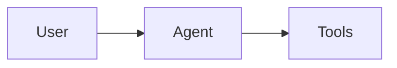

---

# Future MCP Architecture

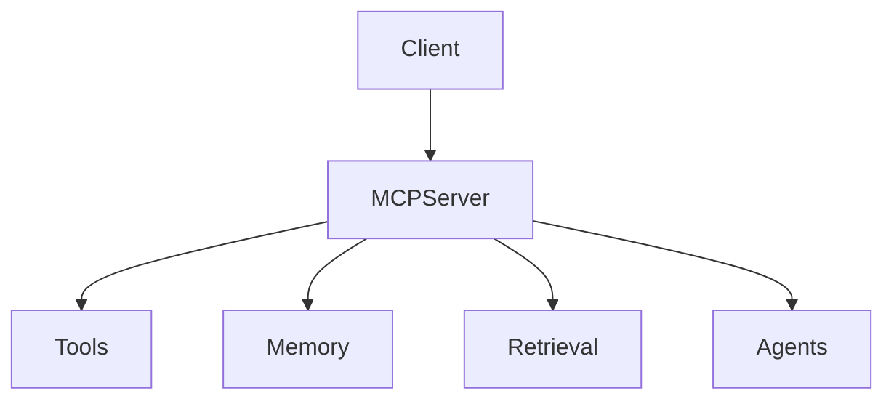

---

# Why This Course Evolves Gradually

Jumping directly into MCP would overwhelm beginners.

So the repository builds concepts progressively:

1. agents
2. runners
3. memory
4. tools
5. orchestration
6. distributed systems
7. MCP

---

# Final Thoughts

This repository is intentionally more architectural than most AI tutorials.

The purpose is to teach:

* how AI systems actually work
* how orchestration layers are built
* how resilient execution is designed
* how scalable agent systems evolve

Understanding these patterns is critical for building production AI systems.
