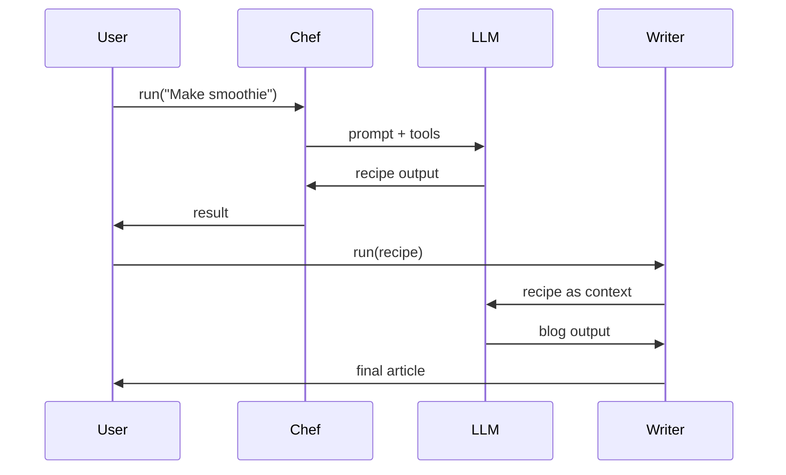

# 🧠 The AI “Black Box” Unlocked: What Actually Happens When You Run an Agent?

You’ve likely seen this code:

```ts
const result = await run(agent, "Hello");
```

At first glance, it looks like a simple function call to an AI.

But in reality, this is not a function call.

It is a **fully orchestrated execution runtime** that coordinates:

* multiple LLM calls
* tool execution (local or remote)
* state reconstruction
* memory simulation
* loop termination logic

What you are actually triggering is:

> 🧠 a controlled reasoning state machine operating over a probabilistic model

---

# ⚙️ 1. The True Nature of `run()`

When you call:

```ts
run(agent, "Hello")
```

you are not “sending a message to an AI.”

You are starting a **looping execution engine** that repeatedly invokes the model until a termination condition is met.

## 🧩 Mental Model: The Agent Is a State Machine

Internally, it behaves like:

```ts
while (!done) {
  observe();
  think();
  act();
  updateState();
}
return result;
```

But critically:

> Each loop iteration is a separate LLM call over the network, not a CPU instruction cycle.

So execution is **distributed across API calls**, not local computation.

---

# 🔄 2. The Agent Execution Cycle

## 🟡 Observe — Context Assembly

The runtime builds the prompt:

* system instructions
* conversation history
* user input
* tool schemas
* runtime state

This becomes the **full model context window**.

---

## 🧠 Think — LLM Inference Step

The model produces one of:

* Final natural language output
* Tool call (function invocation)
* Structured intermediate output

Important clarification:

> The model is not executing deterministic reasoning steps — it is sampling the next token sequence conditioned on context.

---

## 🔧 Act — Tool Execution Layer

If the model emits a tool call:

```json
{
  "tool": "web_search",
  "arguments": { "query": "AI news" }
}
```

Then:

1. The runtime intercepts the call
2. Executes the tool (locally or remotely)
3. Captures the result

Example output:

```txt
"[Search results for: AI news]"
```

This result is appended back into the context.

---

## 🔁 Reflect — Re-entry into the Loop

The updated context now includes:

* previous history
* tool outputs
* system instructions

The runtime sends another LLM request.

This loop continues until:

* the model produces a final answer
* or a max iteration limit is reached

---

## 🏁 Terminate — Final State

When no further tool calls are produced, the runtime returns:

```ts
{
  finalOutput: "...",
  history: [...],
  newItems: [...],
  lastAgent: {...}
}
```

---

# ⏳ 3. Why `await` Is Essential

```ts
const result = await run(agent, "Hello");
```

This is not waiting for a function.

It is waiting for a **distributed execution graph to complete**.

Without `await`:

```ts
const result = run(...);

console.log(result.finalOutput); // ❌ undefined
```

Because:

* LLM calls are asynchronous network requests
* tool execution is asynchronous
* multiple iterations may still be running

So:

> `await` = wait until the agent state machine reaches a terminal state

---

# 🧠 4. Context Is Not Memory (It Is Reconstruction)

Agents do not have persistent memory.

Instead:

> Every step reconstructs “memory” by resending full context.

Example:

```ts
[
  { role: "system", content: "You are a chef assistant" },
  { role: "user", content: "Hello" },
  { role: "assistant", content: "Hi!" },
  { role: "user", content: "Make pasta" }
]
```

This is rebuilt on every call.

---

## 🧠 Key Insight

There is no persistent internal state in the model.

Only:

> 🔁 repeated reconstruction of context per request

---

## 💸 Why This Becomes Expensive

Token usage grows with:

| Component     | Behavior          |
| ------------- | ----------------- |
| System prompt | constant overhead |
| History       | grows linearly    |
| Tool outputs  | often large       |
| Summaries     | cost optimization |

So naive systems scale poorly.

---

## 🧹 Common Mitigations

### 1. Pruning

```ts
history = history.slice(-10);
```

### 2. Summarization

```txt
User is building a high-protein nutrition app.
```

### 3. Structured Memory

```ts
{
  goal: "high protein diet",
  constraints: ["low carb", "vegetarian"]
}
```

---

# 🧠 5. Multi-Agent Chaining (Correct Mental Model)

Multi-agent chaining is NOT agent-to-agent communication.

It is:

> 🧩 sequential execution of independent runtimes where outputs become inputs

Example:

```ts
const recipe = await run(recipeAgent, "Make smoothie");
const blog = await run(blogAgent, recipe.finalOutput);
```

---

## 🔗 Key Truth

Agents do not communicate directly.

Instead:

> One agent’s output becomes the next agent’s input context

---

## 🧠 Assembly Line Model

```
Chef Agent → Writer Agent → Editor Agent
```

Each step:

* starts fresh
* has no internal memory of previous agents
* only sees structured input

---

## ⚙️ Execution Flow



---

## 🧠 Key Insight

Each run is:

> a fully isolated reasoning system with no shared hidden state

Only data flows forward.

---

# 🧾 6. How `history`, `newItems`, and `lastAgent` Are Produced

These are not logs — they are **structured projections of the same execution trace**.

---

## 📜 `history` — Full Execution Trace

A complete record of everything:

* user messages
* assistant messages
* tool calls
* tool results
* intermediate steps

Think:

> 📼 full CCTV recording of the execution

Internally:

```ts
history.push(event);
```

Where:

```ts
type Event =
  | UserMessage
  | AssistantMessage
  | ToolCall
  | ToolResult;
```

---

## 🆕 `newItems` — Delta of Current Run

Represents only what happened during this execution cycle:

```ts
newItems = history.slice(previousCheckpoint);
```

Think:

> 🆕 “what just happened in this run”

Used for:

* streaming UIs
* debugging tool execution
* incremental rendering

---

## 🧍 `lastAgent` — Final Executor Pointer

Represents the agent responsible for the final output.

Why it matters:

> In multi-agent systems, the initiating agent is not always the one that completes execution.

Example:

```
Router → Research → Writer → Editor
```

Final output may come from:

```
EditorAgent
```

So internally:

```ts
result.lastAgent = EditorAgent;
```

Think:

> 🧍 ownership of final reasoning step

---

# 🧠 7. Unified Mental Model

| Field       | Meaning        | Mental Model        |
| ----------- | -------------- | ------------------- |
| `history`   | full trace     | CCTV recording      |
| `newItems`  | delta trace    | latest episode      |
| `lastAgent` | final executor | last worker on line |

---

# 🚀 Final Mental Model

When you run an agent system, you are not calling AI.

You are orchestrating a system that:

> 🧩 repeatedly reconstructs context, calls probabilistic models, executes tools, updates state, and converges toward a final output

