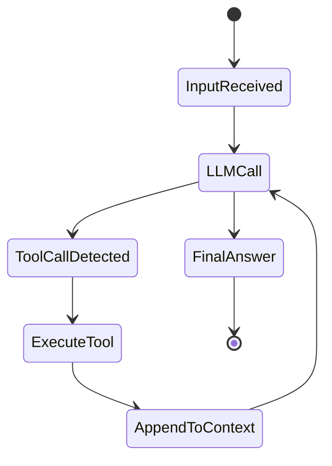
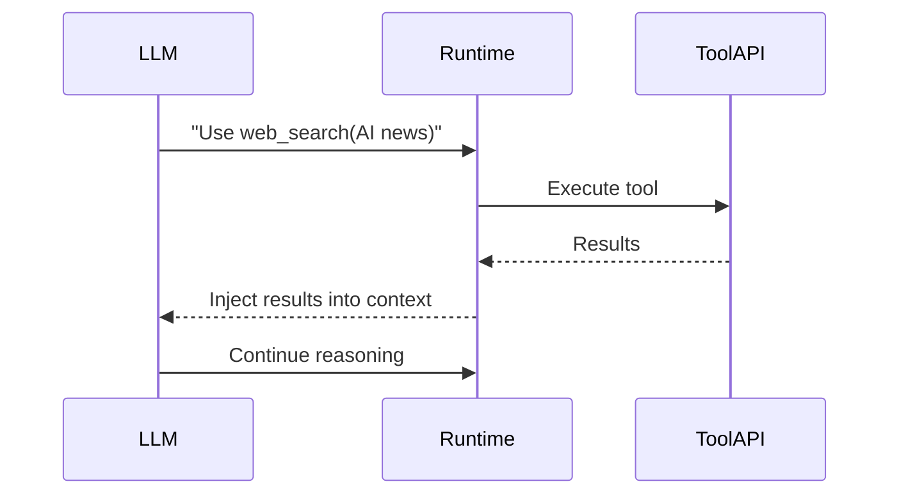
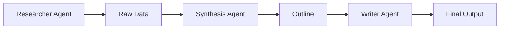
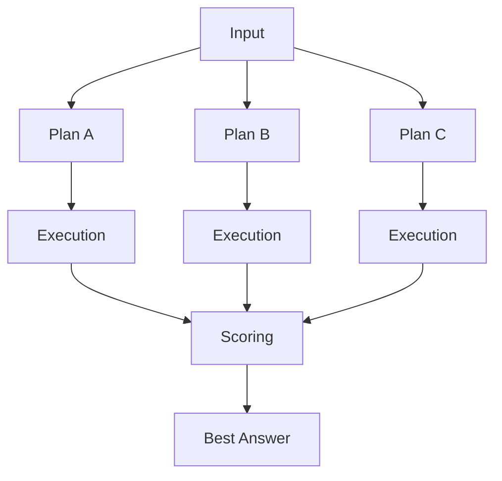

# 🧠 The AI “Black Box” Unlocked: Engineering the Agent Runtime

I’ve often seen this line in AI documentation:

```ts
const result = await run(agent, "Hello");
```

At first glance, it looks like a normal function call.

But once I started building agent systems seriously, I realized something important:

**It isn’t a function call at all.**

When I call `run()`, I’m not invoking a simple deterministic function—I’m launching a **multi-step execution runtime** that behaves more like:

> a state machine + orchestrator + tool scheduler + memory reconstruction engine

In this post, I want to walk through how I personally understand and build this system. Not as abstract theory, but as something I would actually implement in production systems.

---

# 1. The Core Execution Loop (How I Think About `run()`)

Whenever I design or debug an agent, I always reduce everything to a loop.

At its core, `run()` is just a controlled reasoning cycle over repeated LLM calls:

```ts
async function run(agent, input) {
  let context = initializeContext(input);

  while (!isTerminal(context)) {
    const thought = await llm.generate(context);
    const action = parseAction(thought);

    if (isToolCall(action)) {
      const toolOutput = await executeTool(action);
      context.append(toolOutput);
    } else {
      return finish(thought);
    }
  }
}
```

## 🧠 My key mental model

I don’t think of this as “the model thinking continuously.”

Instead, I think of it like this:

> each loop iteration is a **network round-trip to an LLM API**

So the real execution looks like:

> Think → Call model → Maybe use tool → Update context → Repeat

There is no hidden continuous reasoning process. Everything is step-by-step, request-by-request.

---

## 🧠 Execution Model (How I visualize it)



What this diagram helps me internalize is:

* the LLM is just a decision point
* the runtime is what actually drives execution
* tools are external effects, not internal logic

---

# 2. Context Is NOT Memory (It’s Reconstruction Every Time)

One of the biggest shifts in my thinking was realizing this:

> Agents do NOT have memory in the traditional sense.

Instead, they reconstruct memory from scratch every single step.

```ts
const chatHistory = [
  { role: "system", content: "You are a helpful assistant." },
  { role: "user", content: "Weather in Singapore?" },
  { role: "assistant", content: "Calling weather API..." },
  { role: "tool", content: "30°C and sunny" }
];

const nextStep = await llm.call(chatHistory);
```

## ⚠️ What this really means in practice

Every time I call the model:

* I resend the entire history
* I reconstruct the full “world state”
* I rely entirely on tokens as memory

That creates three hard constraints:

* more tokens → higher cost
* more tokens → higher latency
* more tokens → context window limits

So I’ve stopped thinking:

> “How do I store memory?”

Instead I ask:

> “How do I compress reality into tokens efficiently?”

---

# 3. Tool Execution: The “Act” Layer

Tools are where agents stop being text generators and start interacting with the real world.

But I always remind myself of this:

> the model does NOT execute tools

It only **requests actions**.

The runtime executes them.



## 🧠 My interpretation

* LLM = planner
* runtime = executor
* tools = interface to the external world

This separation is critical. Without it, systems become un-debuggable very quickly.

---

# 4. Multi-Agent Systems = Pipelines (Not Conversations)

Early on, I mistakenly thought agents “talk” to each other.

They don’t.

Instead, I now think of them as a pipeline:

```ts
const recipe = await run(chefAgent, "Make smoothie");
const blog = await run(writerAgent, recipe.finalOutput);
```


## 🧠 How I understand this

Each agent is:

* stateless across runs
* unaware of other agents
* purely input → output

There is no shared intelligence.

Only **data passing through stages**.

---

# 5. Understanding `run()` Results

In real systems, I never treat `run()` as “just text output.”

It usually returns structured metadata:

| Field     | Meaning                 |
| --------- | ----------------------- |
| history   | Full execution trace    |
| newItems  | Incremental updates     |
| lastAgent | Final agent responsible |

## 🧠 My mental model

* history → CCTV recording of everything
* newItems → latest snapshot of progress
* lastAgent → final worker that finished

This is extremely useful for debugging and observability.

---

# 6. Context Optimization (Where Cost Is Controlled)

If I don’t manage context, agent systems become expensive very quickly.

So I rely on three core strategies:

---

## 1. Rolling Window

```ts
const optimized = fullHistory.slice(-10);
```

I keep only recent context.

Simple, but effective.

---

## 2. Summarization

Instead of full logs, I compress meaning:

> “User is building a vegetarian low-carb meal planner.”

This is one of the most important cost optimizations in production systems.

---

## 3. Structured State (My Preferred Approach)

```ts
const state = {
  goal: "Meal plan generator",
  diet: ["vegetarian", "low-carb"],
  completed: ["research"]
};
```

Instead of sending full history, I inject this compact representation each time.

This is far more stable and scalable.

---

# 7. Building a Tool (How I Define Capabilities)

A tool is just a function exposed to the runtime.

```ts
const weatherTool = {
  name: "get_weather",
  description: "Get weather by city",
  parameters: { city: "string" },

  execute: async ({ city }) => {
    const res = await fetch(`https://api.weather.com/${city}`);
    return `Weather in ${city}: 25°C`;
  }
};
```

## 🧠 My takeaway

Good tools must be:

* deterministic
* stateless
* reliable

Otherwise the entire agent becomes unpredictable.

---

# 8. Building a Custom `run()` Loop

At the lowest level, everything reduces to this:

```ts
async function runAgent(agent, prompt) {
  let history = [{ role: "user", content: prompt }];

  while (true) {
    const response = await llm.generate(history);
    history.push({ role: "assistant", content: response });

    if (isFinalAnswer(response)) return response;

    const toolCalls = parseToolCalls(response);

    if (toolCalls.length > 0) {
      const results = await executeTools(toolCalls, agent.tools);

      history.push({
        role: "tool",
        content: JSON.stringify(results)
      });
    }
  }
}
```

## 🧠 My interpretation

This is not “AI logic.”

It is simply:

> a state machine wrapped around an LLM API

---

# 9. The Reflective Loop (Self-Correction)

One of the most powerful patterns I use is feedback injection:

```ts
catch (error) {
  history.push({
    role: "system",
    content: `Tool failed: ${error.message}. Retry with corrected args.`
  });
}
```

## 🧠 What this achieves

Instead of crashing, the agent:

* observes failure
* updates context
* retries execution

It looks like learning, but it is really just **context manipulation**.

---

# 10. Multi-Agent Architecture (Deep Research Systems)

When I scale systems, I split responsibilities into roles:



Each agent has a single responsibility:

* gather
* structure
* write

This makes systems far easier to debug and scale.

---

# 11. Structured Contracts (Zod Schemas)

To keep systems reliable, I enforce structure:

```ts
const ResearcherOutputSchema = z.object({
  sources: z.array(z.string().url()),
  keyFindings: z.array(z.string()),
  summary: z.string()
});
```

## 🧠 Why this matters

Without structure:

* agents hallucinate formats
* pipelines break silently

With structure:

* everything becomes testable
* everything becomes predictable

---

# 12. Validation Guard

I always insert a validation layer between steps:

```ts
async function validationGuard(data, schema) {
  try {
    return schema.parse(data);
  } catch (err) {
    return { isValid: false, error: err.message };
  }
}
```

This becomes a **safety checkpoint between agents**.

---

# 13. Human-in-the-Loop Safety

Not everything should be automatic.

```ts
async function executeWithApproval(toolCall) {
  console.log("Agent wants:", toolCall);

  const approved = await requestUserApproval();

  if (!approved) return "Cancelled";

  return executeTool(toolCall);
}
```

## 🧠 My rule

If it affects real-world systems, I prefer a human approval step.

---

# 14. Persistence (Checkpoint Pattern)

Agents must survive crashes.

```ts
async function runAgentWithPersistence(runId, agent, input) {
  let state = await db.getState(runId) || {
    history: [{ role: "user", content: input }]
  };

  while (!isTerminal(state.history)) {
    const step = await llm.generate(state.history);
    state.history.push(step);

    await db.saveState(runId, state);
  }
}
```

## 🧠 Why this matters

Without persistence:

* long workflows break easily
* debugging becomes impossible

---

# 15. Structured Output Prompting

I often enforce strict output formats:

> “Return ONLY valid JSON matching schema. No explanations.”

Or I use JSON mode when available.

---

# 16. Test-Driven Agent Development

Yes—agents should be testable.

```ts
test("valid researcher output", async () => {
  const result = await researcherAgent.run("AI trends");

  const validation = ResearcherOutputSchema.safeParse(result);

  expect(validation.success).toBe(true);
});
```

---

# 17. Database Design for Runs

I usually persist everything:

```sql
CREATE TABLE runs (
    id UUID PRIMARY KEY,
    status TEXT,
    created_at TIMESTAMP
);

CREATE TABLE steps (
    id UUID PRIMARY KEY,
    run_id UUID,
    sequence_index INT,
    latency_ms INT,
    cost_usd DECIMAL
);

CREATE TABLE tool_calls (
    id UUID PRIMARY KEY,
    step_id UUID,
    tool_name TEXT,
    arguments JSONB,
    status TEXT,
    latency_ms INT,
    cost_usd DECIMAL
);
```

---

# 18. Recovery Agent

When systems fail repeatedly, I escalate:

```ts
if (errorCount > 3) {
  await recoveryAgent.run({
    context: history,
    errors
  });
}
```

## Role

* diagnose failures
* correct tool usage
* propose fixes

---

# 19. Mocking LLMs

For testing, I replace real models:

```ts
class MockLLM {
  constructor(responses) {
    this.responses = responses;
  }

  async generate() {
    return this.responses.shift();
  }
}
```

---

# 20. Performance Tracking

I track everything for observability:

```sql
ALTER TABLE steps ADD COLUMN latency_ms INT;
ALTER TABLE steps ADD COLUMN cost_usd DECIMAL;
```

---

# FINAL: My Mental Model

I never think of agents as:

> “a chatbot with tools”

I think of them as:

> a distributed execution engine with:

* a state machine loop
* a memory reconstruction system
* a tool scheduler
* a validation pipeline
* a persistence layer
* multi-agent orchestration

---

# PART II — Parallel Tool Execution

Now I upgrade the system.

---

# 21. Parallel Tool Execution

Instead of sequential execution:

> tool → wait → tool → wait

I execute:

> tool A + tool B + tool C at the same time

---

## Treat tools like Promises

```ts
await Promise.all([...])
```

---

# 22. Multiple Tool Calls

```ts
[
  { tool: "weather", args: { city: "Singapore" } },
  { tool: "weather", args: { city: "Tokyo" } },
  { tool: "weather", args: { city: "London" } }
]
```

---

## Parallel execution engine

```ts
async function executeToolsInParallel(toolCalls, registry) {
  return Promise.all(
    toolCalls.map(async (call) => {
      const tool = registry[call.tool];

      if (!tool) return { error: "not found" };

      try {
        const result = await tool.execute(call.args);
        return { tool: call.tool, result };
      } catch (e) {
        return { tool: call.tool, error: e.message };
      }
    })
  );
}
```

---

## Updated run loop

```ts
const results = await executeToolsInParallel(toolCalls, agent.tools);
```

---

## Before vs After

Sequential:

```
T1 → T2 → T3 → LLM
```

Parallel:

```
T1
T2   → merge → LLM
T3
```

---

## Key shift

From:

> agent calls tools

To:

> agent schedules tasks

---

# PART III — Speculative Execution Agents

Now we go deeper.

---

# 31. Speculative Execution

Instead of one path:

> I explore multiple reasoning paths at the same time

---

## Core idea

```
A → (B1, B2, B3) → evaluate → best result
```

---

## Execution tree



---

## Step 1: Generate plans

```ts
const plans = JSON.parse(await llm.generate(...));
```

---

## Step 2: Execute branches

```ts
const branches = await Promise.all(
  plans.map(plan => executePlan(plan))
);
```

---

## Step 3: Score branches

```ts
const score = await llm.generate([
  { role: "system", content: "Score 0–10" },
  { role: "user", content: JSON.stringify(branch) }
]);
```

---

## Step 4: Select best

```ts
return branches.sort((a, b) => b.score - a.score)[0];
```

---

# 🧠 Final Insight

This is no longer a chatbot.

It is:

> a probabilistic reasoning search engine over execution graphs

---

# FINAL EVOLUTION PATH

1. Chatbot
2. Tool-using agent
3. Parallel tool execution agent
4. Multi-agent pipeline
5. Speculative execution agent

---

# 🚀 Closing Thought

I don’t think of this as building “AI features.”

I think of it as building:

> **execution systems over reasoning space**

---

## Key Takeaways (My Engineering Perspective)

**From Linear to Parallel:**
Parallel tool execution removes the biggest bottleneck in agent systems—sequential waiting on external I/O.

**Context Reconstruction Tax:**
The real cost of agents is not “thinking,” but repeatedly reconstructing state from tokens.

**Speculative Execution is the Future:**
Instead of generating one answer, I am effectively exploring a space of possible reasoning paths and selecting the best outcome.

---

This is how I now see agent systems: not as magic, not as chatbots, but as **structured execution engines layered on top of probabilistic models.**
