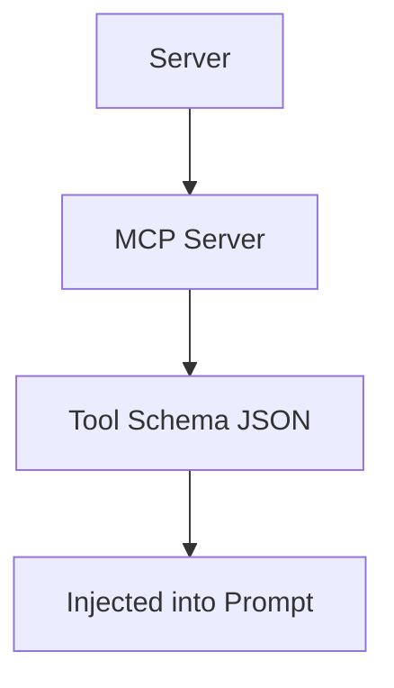
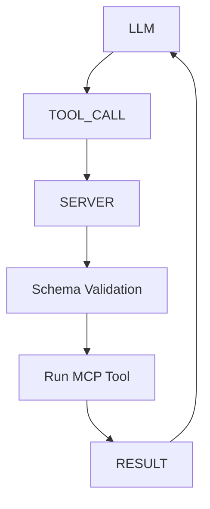
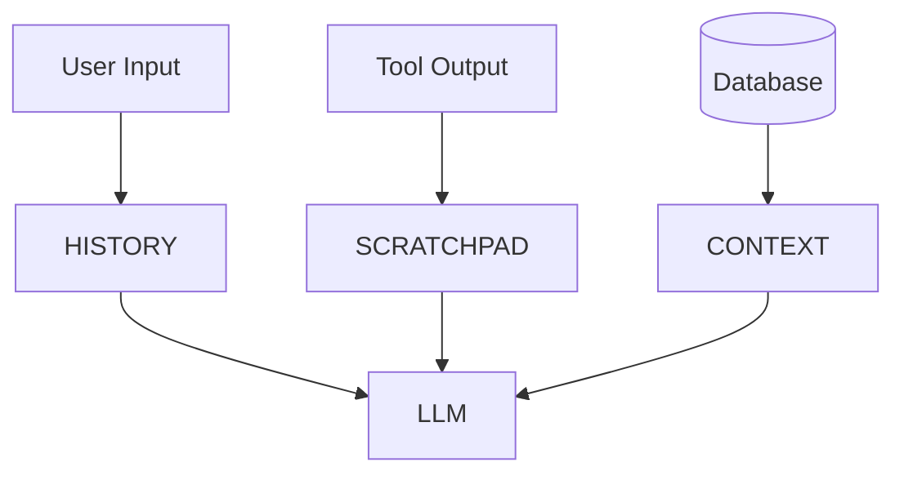
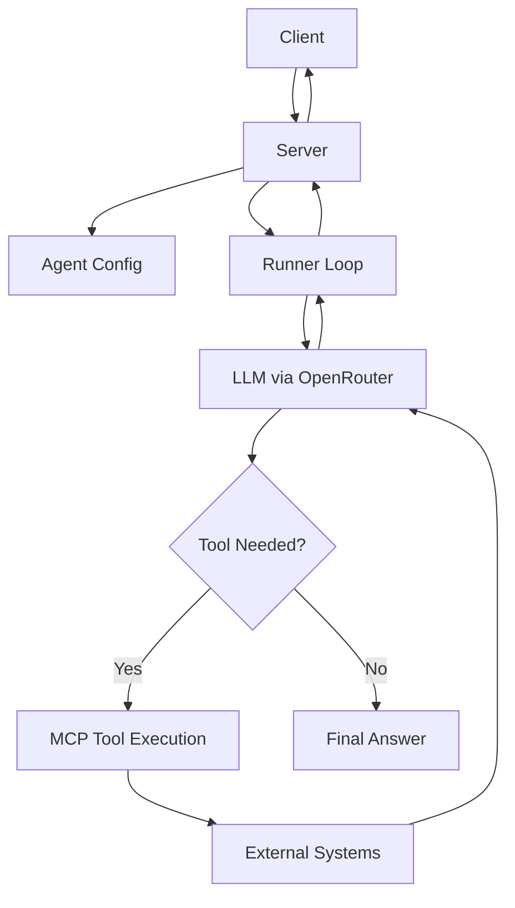

# 🚀 OpenRouter MCP Course Student Guide

---

# 🧠 PART 1 — WHAT ARE YOU ACTUALLY BUILDING?

Before diving into code, you must understand the real system.

You are NOT building a chatbot.

You are building:

> 🧠 A stateful AI execution engine that can THINK, ACT, and REMEMBER

---

## 🔥 The real mental model

Instead of:

```txt
User → ChatGPT → Answer
```

You are building:

```txt
User → Server → Runner → LLM → Tools → Memory → Result
```

---

## 🧠 Core components

| Component | Role                     |
| --------- | ------------------------ |
| Client    | Sends request            |
| Server    | Orchestrates system      |
| Runner    | Executes reasoning loop  |
| LLM       | Thinks                   |
| MCP Tools | Act (external execution) |
| Memory    | Stores state             |

---

# 🧠 PART 2 — WHAT IS A RUNNER?

The Runner is the MOST important piece.

It is:

> 🔁 the execution loop that connects LLM reasoning to real-world actions

---

## 🧠 Simple definition

```txt
Runner = deterministic loop controlling non-deterministic LLM
```

---

## 🧠 Why Runner exists

Because LLMs are:

* stateless
* probabilistic
* cannot execute tools directly
* cannot manage memory

So we wrap them in a controlled loop.

---

# 🔁 PART 3 — CORE RUNNER LOOP (MASTER LOGIC)

This is the heart of the system.

---

## 🧠 Runner responsibilities

Each cycle:

1. Send context to LLM
2. Check response type
3. If tool call → execute tool
4. Feed result back into LLM
5. Repeat until final answer

---

## 🔥 Production-grade pseudo-code

```python
async def run_agent(agent, user_input, state):
    # 1. Store user input in state
    state.add("user", user_input)

    # 2. Safety limit (VERY IMPORTANT)
    max_loops = 10

    for _ in range(max_loops):

        # 3. Call LLM with full context + tools
        response = await llm.generate(
            state.get_context(),
            tools=agent.tools
        )

        # 4. TOOL CALL PATH
        if response.has_tool_call():

            tool_name = response.tool_name
            tool_args = response.tool_args

            # 4.1 Execute MCP tool
            result = await mcp_client.execute(
                tool_name,
                tool_args
            )

            # 4.2 Store tool result in memory
            state.add("tool", result)

            # 4.3 Continue reasoning loop
            continue

        # 5. FINAL ANSWER PATH
        return response.text

    raise Exception("Max loop limit reached")
```

---

# 🧠 PART 4 — WHY THIS LOOP IS PRODUCTION GRADE

---

## 🧠 1. Safety (CRITICAL)

You never trust LLM output.

Before executing tools:

* validate input (Zod / Pydantic)
* sanitize arguments
* enforce schema constraints

---

## 🧠 2. Traceability

Because state is external:

```txt
state = full execution log
```

You can:

* replay execution
* debug failures
* audit tool usage

---

## 🧠 3. State control

You decide:

* what LLM remembers
* what is summarized
* what is deleted
* what is persisted

---

## 🧠 4. Cost control

You can:

* prune history
* summarize old messages
* avoid token explosion

---

# ⚠️ CRITICAL PRODUCTION SAFETY RULES

---

## 🔁 1. Max loop limit

Without this:

```txt
LLM → tool → LLM → tool → forever
```

Always enforce:

```txt
max_loops = 5–10
```

---

## 👨‍💻 2. Human-in-the-loop control

For sensitive tools:

* email sending
* database deletion
* payments

Add approval step:

```txt
pause → human approval → execute tool
```

---

## 🧯 3. Tool isolation

Tools must run in sandbox:

* no unrestricted file system access
* no uncontrolled network calls
* no raw system access

---

# 🔌 PART 5 — MCP TOOL EXECUTION ARCHITECTURE

MCP = tool protocol layer.

It defines:

> 🧱 how LLMs discover and execute tools safely

---

# 🧠 STEP 1 — TOOL DISCOVERY (HANDSHAKE)

Before execution:

```txt
Server → MCP Server: tools/list
```

Returns:

* tool name
* schema
* input format
* output format

---

## 🔥 Discovery flow



---

# 🧠 STEP 2 — TOOL EXECUTION FLOW

When LLM requests a tool:

---

## 🔥 Execution pseudo-code

```python
async def execute_tool(tool_call):

    # 1. Lookup tool
    tool = registry.get(tool_call.name)

    # 2. Validate schema (VERY IMPORTANT)
    validated_args = tool.schema.parse(tool_call.args)

    # 3. Execute via MCP
    result = await mcp_client.call_tool(
        tool_call.name,
        validated_args
    )

    return {
        "status": "success",
        "data": result
    }
```

---

# 🧠 TOOL EXECUTION FLOW (DIAGRAM)



---

# 🧠 WHY MCP IS POWERFUL

---

## 🔥 1. Standardization

All tools follow:

```txt
JSON Schema contract
```

---

## 🔥 2. Auto discovery

No hardcoding tools in runner.

---

## 🔥 3. Interoperability

Same tool works across:

* OpenAI
* LangGraph
* custom agents
* OpenRouter systems

---

## 🔥 4. Maintainability

Tool changes do NOT break system.

---

# 📊 MCP vs Raw APIs

| Feature   | Raw API      | MCP          |
| --------- | ------------ | ------------ |
| Discovery | manual       | automatic    |
| schema    | inconsistent | standardized |
| updates   | break agents | safe         |
| scaling   | hard         | easy         |
| reuse     | low          | high         |

---

# 🧠 PART 6 — MEMORY IS NOT CHAT HISTORY

This is the most misunderstood concept.

Memory = NOT just messages.

Memory = STATE.

---

# 🧱 THREE TYPES OF MEMORY

| Type       | Meaning       | Persistence |
| ---------- | ------------- | ----------- |
| Short-term | last messages | RAM         |
| Scratchpad | tool outputs  | session     |
| Long-term  | user data     | DB          |

---

# 🧠 STATE OBJECT MODEL

```python
class AgentState:
    def __init__(self):
        self.history = []
        self.scratchpad = {}
        self.context = {}

    def add(self, role, content):
        self.history.append({
            "role": role,
            "content": content
        })
```

---

# 🧠 MEMORY FLOW



---

# 🧠 KEY IDEA

> The LLM does NOT remember anything.
>
> The SERVER feeds it memory every step.

---

# 🧠 PART 7 — MEMORY STRATEGIES (PRODUCTION)

---

# 🔁 1. Sliding window

Only keep last N messages:

```txt
last 10–20 turns only
```

Older messages:

* summarized
* compressed
* archived

---

# 📦 2. Scratchpad strategy

Instead of dumping huge tool results:

```txt
❌ full JSON (bad)
✔ summary + reference ID (good)
```

---

Example:

```txt
[FileList_001]
```

---

# 🧠 3. Entity memory

Store structured facts:

```json
{
  "shopping_list": "default",
  "user_preference": "vegetarian"
}
```

---

# 🧠 PART 8 — WHY THIS IS PRODUCTION GRADE

---

## 🔥 1. Replayability

You can replay:

```txt
state.json → rerun → exact same result
```

---

## 🔥 2. Observability

You can inspect:

* every tool call
* every model decision
* full trace

---

## 🔥 3. Cost efficiency

You control:

* context size
* token usage
* summarization strategy

---

## 🔥 4. Consistency

LLM is no longer guessing.

It reads:

```txt
Server-controlled truth (state)
```

---

# 🧠 PART 9 — FULL SYSTEM FLOW (FINAL VIEW)

---



---

# 🧠 FINAL MASTER INSIGHT

If you remember only one thing:

---

## ❌ WRONG MODEL

```txt
LLM = chatbot brain
```

---

## ✅ CORRECT MODEL

```txt
AI System =
  Server (orchestration)
  + Runner (execution loop)
  + LLM (reasoning engine)
  + MCP Tools (actions)
  + Memory (state)
```

---

## 🚀 FINAL TRUTH

> You are not calling an AI.
>
> You are operating a distributed execution system where the LLM is just one component.

